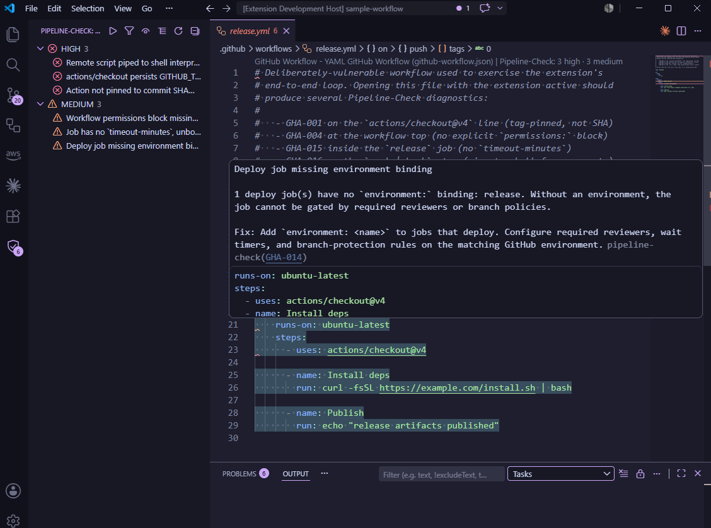
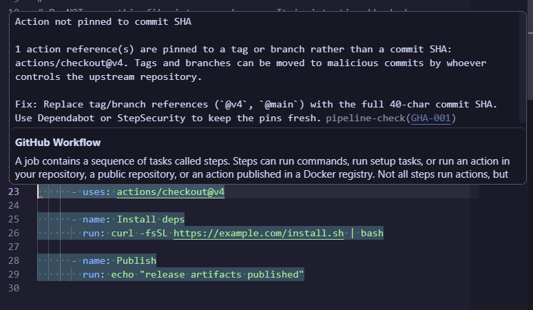
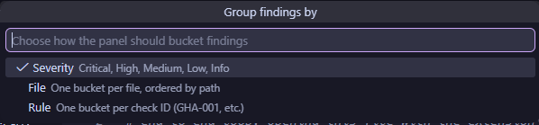
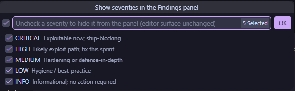

# Pipeline-Check VS Code extension

[](https://github.com/greylag-ci/pipeline-check-vscode/actions/workflows/ci.yml)
[](https://github.com/greylag-ci/pipeline-check-vscode/actions/workflows/codeql.yml)
[](https://marketplace.visualstudio.com/items?itemName=greylag-ci.pipeline-check)
[](https://open-vsx.org/extension/greylag-ci/pipeline-check)
[](https://marketplace.visualstudio.com/items?itemName=greylag-ci.pipeline-check)
[](https://socket.dev/openvsx/package/greylag-ci.pipeline-check/overview)
[](LICENSE)
[](https://coderabbit.ai)

Lint CI/CD pipelines for 39 providers against OWASP Top 10 CI/CD Risks and 17 other compliance frameworks. 1220+ rules, inline in your editor: severity-graded gutter squiggles, hover descriptions with `--explain` prose, and recommended-action hints. Built on the same rule registry as the [pipeline-check](https://github.com/dmartinochoa/pipeline-check) CLI, so editor findings match `pipeline_check --output json` byte-for-byte (modulo position translation).









## Features

- **Inline diagnostics** — gutter squiggles + the Problems panel get a row per finding, severity-graded so CRITICAL and HIGH read red, MEDIUM yellow, LOW info-blue. Hover shows the rule title, the `--explain` prose, and a link to the rule documentation.
- **Findings panel** — dedicated slot in the activity bar with a Pipeline-Check pipeline glyph. Re-groups findings by **severity** (default), **file**, or **rule** via the title-bar **Change Grouping** button; activity-bar icon carries a live count badge.
- **Per-panel severity filter** — title-bar **Show / Hide Severities** button lets you mute MEDIUM while triaging CRITICAL without changing the editor-wide `severityThreshold` setting. State persists per workspace.
- **Quick-fix lightbulb** — every finding carries a lightbulb with **Open `<RULE-ID>` documentation**, **Copy rule ID**, and **Show in Findings panel** — useful for triage without round-tripping through the panel.
- **Status bar item** — bottom-left of the window, shows the top two severity counts at a glance (e.g. `🛡 3C 1H`). Tooltip carries the engine version so you know which `pipeline_check` install is talking to the editor. Click reveals the Findings panel.
- **CodeLens summary** — every scanned file carries a `Pipeline-Check: 2 critical · 1 high` lens at line 1. Click navigates to the Findings panel.
- **Keyboard navigation** — `Alt+F8` / `Shift+Alt+F8` jump between findings, with wrap at both ends. Mirrors VS Code's `F8` for "next problem" so muscle memory carries over.
- **Tunable signal** — `pipelineCheck.severityThreshold` quiets the editor surface (`low` / `medium` / `high` / `critical`) without restarting the server; `pipelineCheck.disabledProviders` silences whole providers in a monorepo where Pipeline-Check would otherwise lint files belonging to a sub-project.
- **Fast-fail engine check** — when the LSP fails to import the Python engine, the extension surfaces the install / upgrade action in under a second instead of waiting out the 30-second start ceiling. Engines below the extension's minimum required version get a dedicated **Upgrade in terminal** prompt.

## What it scans

Pilot provider coverage (single-file workflow providers plus Dockerfile):

| Provider | Trigger file(s) |
|---|---|
| GitHub Actions | `.github/workflows/*.yml` / `*.yaml` |
| GitLab CI | `.gitlab-ci.yml` / `.gitlab-ci.yaml` |
| Azure DevOps | `azure-pipelines.yml` / `azure-pipelines.yaml` |
| Bitbucket Pipelines | `bitbucket-pipelines.yml` / `bitbucket-pipelines.yaml` |
| CircleCI | `.circleci/config.yml` / `.circleci/config.yaml` |
| Google Cloud Build | `cloudbuild.yml` / `cloudbuild.yaml` |
| Buildkite | `.buildkite/pipeline.yml` / `.buildkite/pipeline.yaml` |
| Drone CI | `.drone.yml` / `.drone.yaml` |
| Jenkins | `Jenkinsfile` (Declarative and Scripted) |
| Dockerfile | `Dockerfile` / `Containerfile` / `Dockerfile.<suffix>` / `*.Dockerfile` |

Multi-file and context-heavy providers (Kubernetes, Helm, Terraform plans, live AWS, CloudFormation, SCM posture) ship in a later release; the CLI already covers them.

For a deeper reference — install recipes for non-VS Code editors (Cursor, Windsurf, VSCodium, Neovim, Helix), the CLI-vs-extension feature matrix, and a troubleshooting block — see the upstream [VS Code extension docs page](https://dmartinochoa.github.io/pipeline-check/integrations/vscode/).

## Install

Pipeline-Check ships as **two pieces** that talk to each other over stdio:

1. **Python rule engine** — the linter itself, installed from PyPI.
2. **VS Code extension** — a thin LSP client (this repo) that spawns the engine and surfaces its findings in the editor.

You need both. The extension does no scanning on its own; if the engine isn't installed, the Findings panel shows an **Install in terminal** button that runs the command below for you.

### 1. Install the Python engine

Requires Python 3.11+ on `PATH`:

```bash
python -m pip install "pipeline-check[lsp]"
```

If `pipeline_check` lives in a virtualenv or under `python3` rather than `python`, point [`pipelineCheck.serverCommand`](#configuration) at an absolute interpreter path.

### 2. Install the extension

Requires VS Code 1.85+. Search for `Pipeline-Check` in the extensions panel, or install from the command line:

```bash
# Microsoft VS Code Marketplace
code --install-extension greylag-ci.pipeline-check

# Open VSX (VSCodium, Gitpod, code-server, Cursor)
codium --install-extension greylag-ci.pipeline-check
```

### 3. Verify

Open any supported config file (see [What it scans](#what-it-scans)) — findings appear inline within a second or two, and the status bar shows a `🛡` tally. If you see `🛡 LSP not ready` instead, run **Pipeline-Check: Show language server output** from the Command Palette; the most common cause is `serverCommand` pointing at an interpreter that doesn't have `pipeline_check` installed.

## Configuration

| Setting | Default | Description |
|---|---|---|
| `pipelineCheck.serverCommand` | `python` | Command used to launch the language server. Override if `pipeline_check` is installed under a different interpreter. Marked `machine-overridable`: workspace overrides require an explicit prompt. |
| `pipelineCheck.serverArgs` | `["-m", "pipeline_check.lsp"]` | Arguments passed to the server command. Marked `machine-overridable` for the same reason. |
| `pipelineCheck.severityThreshold` | `low` | Lowest severity that produces a diagnostic. One of `low`, `medium`, `high`, `critical`. Mirrors the CLI's `--severity-threshold`. |
| `pipelineCheck.disabledProviders` | `[]` | Provider IDs to silence entirely. Diagnostics for files matching a disabled provider's path glob are dropped before they reach the editor. One of `github-actions`, `gitlab`, `azure`, `bitbucket`, `circleci`, `cloud-build`, `buildkite`, `drone`, `jenkins`, `dockerfile` (covers Containerfile too). |
| `pipelineCheck.trace.server` | `off` | Traces LSP traffic. Set to `verbose` when debugging. |

## Commands and keybindings

All commands appear in the Command Palette under the **Pipeline-Check** category.

| Command | Default keybinding |
|---|---|
| **Restart language server** — kills and respawns the LSP process |  |
| **Show language server output** — focuses the output channel (LSP server logs + `[client]` client-side breadcrumbs) |  |
| **Install LSP Server in Terminal** — opens a terminal with the `pip install` command typed but not executed |  |
| **Upgrade LSP Server in Terminal** — same flow with `pip install --upgrade` for an out-of-date engine |  |
| **Go to Next Finding** | <kbd>Alt</kbd>+<kbd>F8</kbd> |
| **Go to Previous Finding** | <kbd>Shift</kbd>+<kbd>Alt</kbd>+<kbd>F8</kbd> |
| **Scan Workspace** — opens every candidate file so the LSP runs `didOpen` on each |  |
| **Change Grouping** (Findings view) — Quick Pick: Severity / File / Rule |  |
| **Show / Hide Severities** (Findings view) — multi-select Quick Pick that mutes severity levels in the panel only (editor surface unchanged) |  |
| **Filter Findings** (Findings view) — substring filter on rule ID, message, or path |  |
| **Refresh** (Findings view) — re-render from the current diagnostic stream |  |

## Workspace trust

Pipeline-Check spawns the configured Python interpreter to analyze workflow files. To keep that subprocess from running on first-open of a freshly-cloned repository, the extension declares `capabilities.untrustedWorkspaces: "limited"` — it stays inactive until the workspace is trusted. The `serverCommand` / `serverArgs` settings are `machine-overridable`, so a malicious `.vscode/settings.json` can't silently swap the interpreter or inject arbitrary args even after trust is granted.

## Development

```bash
npm install
npm run compile           # typecheck + esbuild dev bundle
npm run watch             # bundle on change
npm test                  # vitest unit suite
npm run test:integration  # @vscode/test-electron — boots a real extension host
npm run smoke             # loads dist/extension.js with a vscode stub
npm run lint
```

Press <kbd>F5</kbd> in VS Code with this folder open to launch an extension-host instance with the extension loaded. Two debug profiles ship in [.vscode/launch.json](.vscode/launch.json):

- **Run Extension**: opens a fresh window with no workspace. Use this when iterating on the client wiring against a checkout of your own code.
- **Run Extension (sample workflow)**: opens `test-fixtures/sample-workflow/` as the workspace. The fixture is a deliberately-vulnerable GitHub Actions workflow and should produce four diagnostics (GHA-001, GHA-004, GHA-015, GHA-016) the moment you open the file. Quickest way to confirm the client → server round-trip works end-to-end.

## Packaging

```bash
npm run package           # delegates to `vsce package`, produces pipeline-check-<version>.vsix
```

## Releasing

Publishing is fully automated by [.github/workflows/publish.yml](.github/workflows/publish.yml). Tag a commit with `vX.Y.Z` matching `package.json#version`, push the tag, and the workflow packages the `.vsix`, publishes to both the VS Code Marketplace and Open VSX, and attaches the artifact to a GitHub Release with the matching `CHANGELOG.md` section as release notes.

```bash
git tag v0.1.2
git push origin v0.1.2
```

**Tag-naming convention:**

- `vX.Y.Z` → stable marketplace channel.
- `vX.Y.Z-rc.N` (or any version with a `-` after the semver core) → pre-release channel; the GitHub release is also marked `prerelease`.

Two repo secrets gate the publish jobs, both stored as **environment secrets** on the `production` GitHub Environment (required reviewer must approve before the publish steps run):

| Secret | Where it comes from |
|---|---|
| `VSCE_PAT` | Azure DevOps PAT scoped to *Marketplace → Manage*, bound to the `greylag-ci` publisher. |
| `OVSX_PAT` | Open VSX access token from the user-settings page, bound to the `greylag-ci` namespace. |

Every PR and every push to `main` is gated by [.github/workflows/ci.yml](.github/workflows/ci.yml) running across `[ubuntu-latest, windows-latest, macos-latest]` with: lint, typecheck, unit tests (vitest), bundle smoke (loads `dist/extension.js` against a `vscode` stub to verify the package is loadable), `npm audit --omit=dev --audit-level=high`, `vsce package`, and on Linux the `@vscode/test-electron` integration suite. Release-day surprises stay rare.

<details>
<summary>Architecture</summary>

```text
┌──────────────────────┐     stdio JSON-RPC      ┌──────────────────────────┐
│ VS Code extension    │ ◀─────────────────────▶ │ pipeline_check.lsp        │
│ (TypeScript, this    │                          │ (Python, pygls; lives in  │
│  repo)               │                          │  dmartinochoa/pipeline-   │
│                      │                          │  check)                   │
└──────────────────────┘                          └──────────────────────────┘
```

The extension spawns `python -m pipeline_check.lsp` as a child process and exchanges Language Server Protocol messages over stdin / stdout. The server reads the same rule registry that powers the CLI, so editor findings match `pipeline_check --output json` byte-for-byte (modulo position translation).

</details>

## Security

Report vulnerabilities privately via GitHub's [Private vulnerability reporting](https://github.com/greylag-ci/pipeline-check-vscode/security/advisories/new) — see [SECURITY.md](SECURITY.md) for the response SLA and threat model.

## License

[MIT](LICENSE).
